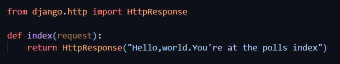

# django部分

### django环境安装

1. 安装python
   通过查看版本验证是否安装

   ```
   python --version
   ```
2. 安装设置数据库
3. 安装django

   `pip install django`

   `python -m django --version`

### django初始化

1. 创建项目

   ```
   mkdir demo
   django-admin startproject project_name demo 
   ```

创建完成后目录


2. 创建应用

   `python manage.py startapp polls`
3. 编写视图

   views.py文件

   
4. 映射视图到URL
5. 配置全局URLconf

### django数据模型

在 Django 中，模型（Model）是用于定义数据结构和数据库表的类。它是 Django 的核心组成部分之一，提供了一种面向对象的方式来与数据库进行交互。

#### **一、模型的定义**

1. 创建模型类：
   * 在 Django 项目的应用目录下，找到 `models.py`文件。
   * 在该文件中，定义一个继承自 `django.db.models.Model`的类，这个类就代表了一个数据库表。
   * 例如：

```python
     from django.db import models

     class Book(models.Model):
         title = models.CharField(max_length=200)
         author = models.CharField(max_length=100)
         publication_date = models.DateField()
```

* 在这个例子中，`Book`类就是一个模型，它代表了一个数据库表，表中有 `title`、`author`和 `publication_date`三个字段。

2. 模型字段：
   * 模型字段是模型类中的属性，用于定义数据库表中的列。
   * Django 提供了多种字段类型，如 `CharField`（字符字段）、`IntegerField`（整数字段）、`DateField`（日期字段）等。
   * 每个字段可以接受一些参数，用于指定字段的属性，如最大长度、默认值、是否为空等。
   * 例如：

```python
     class Book(models.Model):
         title = models.CharField(max_length=200, unique=True)
         author = models.CharField(max_length=100, null=True)
         publication_date = models.DateField(default=datetime.date.today)
```

* 在这个例子中，`title`字段是一个字符字段，最大长度为 200，并且必须唯一。`author`字段可以为空。`publication_date`字段的默认值是当前日期。

##### * 模型字段类型及属性

在 Django 中，模型字段类型用于定义数据库表中的列的数据类型。以下是一些常见的 Django 模型字段类型及其属性：

###### **一、数值类型**

1. `IntegerField`：整数类型字段。
   * 属性：
     * `null`：如果为 `True`，则该字段可以为空值（数据库中存储为 NULL）。默认值是 `False`。
     * `blank`：如果为 `True`，则该字段在表单中可以为空。默认值是 `False`。
     * `choices`：一个可迭代的二元组列表，用于提供该字段的可选值。例如 `choices=[(1, '选项一'),(2, '选项二')]`。
     * `default`：该字段的默认值。
2. `DecimalField`：十进制小数类型字段。
   * 属性：
     * `max_digits`：总位数。
     * `decimal_places`：小数位数。
     * 其他属性与 `IntegerField`类似。
3. `FloatField`：浮点数类型字段。
   * 属性与 `IntegerField`类似。

###### **二、字符类型**

1. `CharField`：字符串类型字段。
   * 属性：
     * `max_length`：字符串的最大长度。
     * `null`、`blank`、`choices`、`default`等属性与 `IntegerField`类似。
2. `TextField`：大文本字段。适合存储大量文本内容，如文章正文等。
   * 属性与 `CharField`类似，但通常不需要指定最大长度。

###### **三、日期和时间类型**

1. `DateField`：日期类型字段。
   * 属性：
     * `auto_now`：如果为 `True`，则每次保存对象时，自动将该字段设置为当前日期。
     * `auto_now_add`：如果为 `True`，则在创建对象时，自动将该字段设置为当前日期。
     * `null`、`blank`、`default`等属性与 `IntegerField`类似。
2. `TimeField`：时间类型字段。
   * 属性与 `DateField`类似。
3. `DateTimeField`：日期时间类型字段。
   * 属性与 `DateField`类似。

###### **四、布尔类型**

1. `BooleanField`：布尔类型字段，存储 `True`或 `False`。
   * 属性与 `IntegerField`类似。

###### **五、关系类型**

1. `ForeignKey`：外键字段，用于建立一对多关系。
   * 属性：
     * `to`：指定关联的模型。
     * `on_delete`：指定当关联的对象被删除时的行为，如 `models.CASCADE`（级联删除）、`models.SET_NULL`（设置为 NULL）等。
     * `related_name`：反向关系的名称。
2. `OneToOneField`：一对一关系字段，类似于 `ForeignKey`，但每个对象只能有一个关联对象。
   * 属性与 `ForeignKey`类似。
3. `ManyToManyField`：多对多关系字段。
   * 属性：
     * `to`：指定关联的模型。
     * `related_name`：反向关系的名称。

###### **六、其他类型**

1. `EmailField`：用于存储电子邮件地址的字符串字段，会自动验证输入是否为有效的电子邮件格式。

   * 属性与 `CharField`类似。
2. `URLField`：用于存储 URL 的字符串字段，会自动验证输入是否为有效的 URL 格式。

   * 属性与 `CharField`类似。
3. `FileField`：用于存储文件的字段。

   * 属性：
     * `upload_to`：指定上传文件的存储路径。
     * `null`、`blank`等属性与 `CharField`类似。
4. `ImageField`：用于存储图像文件的字段，继承自 `FileField`，会自动验证上传的文件是否为图像格式。

   * 属性与 `FileField`类似。

#### **二、模型关系**

1. 一对一关系（OneToOneField）：
   * 用于表示两个模型之间的一对一关系。
   * 例如，一个用户只有一个个人资料，可以这样定义模型：

```python
     from django.db import models

     class User(models.Model):
         username = models.CharField(max_length=50)

     class Profile(models.Model):
         user = models.OneToOneField(User, on_delete=models.CASCADE)
         bio = models.TextField()
```

* 在这个例子中，`Profile`模型与 `User`模型之间是一对一关系，一个用户只有一个个人资料。

2. 一对多关系（ForeignKey）：
   * 用于表示两个模型之间的一对多关系。
   * 例如，一个作者可以有多本书，可以这样定义模型：

```python
     from django.db import models

     class Author(models.Model):
         name = models.CharField(max_length=100)

     class Book(models.Model):
         title = models.CharField(max_length=200)
         author = models.ForeignKey(Author, on_delete=models.CASCADE)
```

* 在这个例子中，`Book`模型与 `Author`模型之间是一对多关系，一个作者可以有多本书。

3. 多对多关系（ManyToManyField）：
   * 用于表示两个模型之间的多对多关系。
   * 例如，一本书可以有多个标签，一个标签也可以属于多本书，可以这样定义模型：

```python
     from django.db import models

     class Book(models.Model):
         title = models.CharField(max_length=200)

     class Tag(models.Model):
         name = models.CharField(max_length=50)
         books = models.ManyToManyField(Book)
```

* 在这个例子中，`Tag`模型与 `Book`模型之间是多对多关系，一本书可以有多个标签，一个标签也可以属于多本书。

#### **三、模型方法**

1. 可以在模型类中定义方法，这些方法可以用于执行特定的业务逻辑。
2. 例如，可以定义一个方法来计算一本书的出版年份：

```python
   from django.db import models

   class Book(models.Model):
       title = models.CharField(max_length=200)
       publication_date = models.DateField()

       def publication_year(self):
           return self.publication_date.year
```

3. 还可以定义 `__str__`方法，用于在调试和管理界面中显示模型的字符串表示。

```python
   class Book(models.Model):
       title = models.CharField(max_length=200)
       author = models.CharField(max_length=100)

       def __str__(self):
           return f'{self.title} by {self.author}'
```

#### **四、模型元数据**

1. 可以通过在模型类中定义一个内部类 `Meta`来指定模型的元数据。
2. 例如，可以指定模型的数据库表名、排序方式等。

```python
   from django.db import models

   class Book(models.Model):
       title = models.CharField(max_length=200)
       author = models.CharField(max_length=100)

       class Meta:
           db_table = 'my_books'
           ordering = ['title']
```

3. 在这个例子中，`Meta`类指定了模型的数据库表名为 `my_books`，并且按照 `title`字段进行升序排序。

#### **五、数据库迁移**

1. 当定义好模型后，需要使用 Django 的数据库迁移功能来创建或更新数据库表。
2. 运行以下命令来生成迁移文件：

```plaintext
   python manage.py makemigrations
```

3. 然后运行以下命令来应用迁移文件：

```plaintext
   python manage.py migrate
```

4. 数据库迁移功能会根据模型的定义自动创建或更新数据库表结构。

通过以上步骤，就可以在 Django 中定义和使用模型来与数据库进行交互。模型提供了一种强大而灵活的方式来管理数据，使得开发人员可以专注于业务逻辑的实现，而无需直接处理数据库操作。


### url映射详解

在 Django 中，URL 映射是将用户请求的 URL 与相应的视图函数进行关联的过程。通过 URL 映射，Django 能够确定如何处理不同的 URL 请求并返回适当的响应。

#### **一、基本概念**

1. **URL 配置模块** ：在 Django 项目中，每个项目都有一个名为 `urls.py`的文件，用于定义项目的 URL 配置。此外，每个应用也可以有自己的 `urls.py`文件，用于定义应用内部的 URL 映射。
2. **URL 模式** ：URL 模式是一个正则表达式，用于匹配用户请求的 URL。当用户请求的 URL 与某个 URL 模式匹配时，Django 会调用相应的视图函数来处理该请求。
3. **视图函数** ：视图函数是一个 Python 函数，用于处理用户请求并返回相应的响应。视图函数通常接收一个 `HttpRequest`对象作为参数，并返回一个 `HttpResponse`对象。

#### **二、URL 配置模块的结构**

1. 项目级 `urls.py`文件：项目级的 `urls.py`文件通常包含项目的根 URL 配置。它可以导入应用级的 `urls.py`文件，并将特定的 URL 模式映射到相应的应用。例如：

```python
   from django.contrib import admin
   from django.urls import path, include

   urlpatterns = [
       path('admin/', admin.site.urls),
       path('myapp/', include('myapp.urls')),
   ]
```

在这个例子中，`admin.site.urls`定义了 Django 管理后台的 URL 配置。`include('myapp.urls')`导入了名为 `myapp`的应用的 `urls.py`文件，并将以 `myapp/`开头的 URL 映射到该应用。

2. 应用级 `urls.py`文件：应用级的 `urls.py`文件通常定义应用内部的 URL 映射。它可以包含多个 URL 模式和视图函数的映射。例如：

```python
   from django.urls import path
   from. import views

   urlpatterns = [
       path('', views.index, name='index'),
       path('about/', views.about, name='about'),
   ]
```

在这个例子中，`urlpatterns`列表定义了两个 URL 模式。第一个模式将空字符串（根 URL）映射到 `views.index`视图函数，并命名为 `index`。第二个模式将 `about/` URL 映射到 `views.about`视图函数，并命名为 `about`。

#### **三、URL 模式的定义**

1. **使用正则表达式** ：Django 使用正则表达式来定义 URL 模式。正则表达式是一种强大的文本匹配工具，可以用于匹配各种复杂的 URL 结构。例如：

```python
   urlpatterns = [
       path(r'^articles/(\d{4})/$', views.year_archive),
       path(r'^articles/(\d{4})/(\d{2})/$', views.month_archive),
   ]
```

在这个例子中，第一个 URL 模式将匹配以 `articles/`开头，后面跟着四位数字的 URL，并将这四位数字作为参数传递给 `views.year_archive`视图函数。第二个 URL 模式将匹配以 `articles/`开头，后面跟着四位数字和两位数字的 URL，并将这两个数字作为参数传递给 `views.month_archive`视图函数。

2. **使用命名参数** ：除了使用正则表达式捕获参数外，还可以使用命名参数来定义 URL 模式。命名参数在 URL 模式中使用 `<参数名>`的形式表示。例如：

```python
   urlpatterns = [
       path('articles/<int:year>/', views.year_archive),
       path('articles/<int:year>/<int:month>/', views.month_archive),
   ]
```

在这个例子中，`year`和 `month`是命名参数，它们将分别被转换为整数类型，并作为参数传递给 `views.year_archive`和 `views.month_archive`视图函数。

3. **包含其他 URL 配置** ：可以使用 `include()`函数来包含其他 URL 配置模块。这在将项目的 URL 配置拆分为多个模块时非常有用。例如：

```python
   from django.urls import path, include

   urlpatterns = [
       path('admin/', admin.site.urls),
       path('myapp/', include('myapp.urls')),
   ]
```

在这个例子中，`include('myapp.urls')`将包含名为 `myapp`的应用的 `urls.py`文件中的 URL 配置。

#### **四、视图函数的调用**

1. **视图函数的参数** ：视图函数通常接收一个 `HttpRequest`对象作为参数，并可以根据需要接收其他参数。这些参数可以是从 URL 模式中捕获的参数，也可以是通过查询字符串传递的参数。例如：

```python
   def year_archive(request, year):
       # 处理请求
       return HttpResponse('Year: {}'.format(year))
```

在这个例子中，`year_archive`视图函数接收一个 `HttpRequest`对象和一个名为 `year`的参数。这个参数是从 URL 模式中捕获的四位数字年份。

2. **返回响应** ：视图函数必须返回一个 `HttpResponse`对象或一个子类对象。`HttpResponse`对象表示一个 HTTP 响应，可以包含响应的内容、状态码和头部信息。例如：

```python
   def index(request):
       return HttpResponse('Hello, world!')
```

在这个例子中，`index`视图函数返回一个简单的文本响应 `Hello, world!`。

#### **五、URL 命名和反向解析**

1. **URL 命名** ：为了方便在模板和代码中引用 URL，可以为每个 URL 模式指定一个名称。这个名称可以在模板中使用 ``标签或在代码中使用 `reverse()`函数进行反向解析。例如：

```python
   urlpatterns = [
       path('articles/<int:year>/', views.year_archive, name='year_archive'),
   ]
```

在这个例子中，为 `year_archive`视图函数对应的 URL 模式指定了一个名称 `year_archive`。

2. **反向解析** ：反向解析是指根据 URL 名称生成相应的 URL。在模板中，可以使用 ``标签来进行反向解析。例如：

```html
   <a href="">2023 Archive</a>
```
