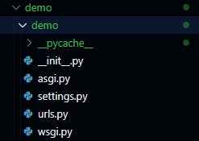

# django部分

### django环境安装

1. 安装python
   通过查看版本验证是否安装

   ```
   python --version
   ```
2. 安装设置数据库
3. 安装django

   `pip install django`

   `python -m django --version`

### django初始化

1. 创建项目

   ```
   mkdir demo
   django-admin startproject project_name demo 
   ```

创建完成后目录



2. 创建应用

   `python manage.py startapp polls`
3. 编写视图

   views.py文件
4. 映射视图到URL
